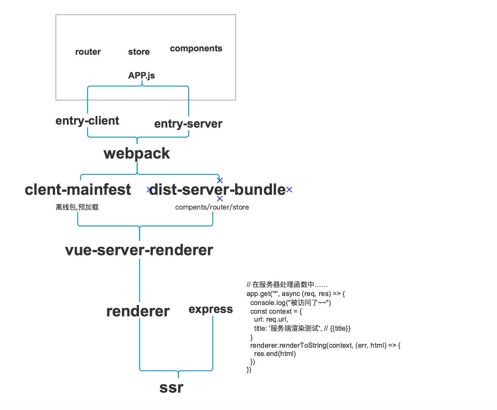

# vue-ssr 入门 (将vue-cli生成的项目转为ssr)

## 目录结构
-no-ssr-demo 未做ssr之前的项目代码用于对比

-vuecli2ssr  将vuecli生成的项目转为ssr

-prerender-demo 使用prerender-spa-plugin 的预渲染demo

-readme-images readme文件的几个图片

## ssr是什么

服务器端将Vue组件直接渲染未html字符串,发送至浏览器,最后在浏览器中混合为可交互的应用程序

服务器渲染的 Vue.js 应用程序也可以被认为是"同构"或"通用"，因为应用程序的大部分代码都可以在服务器和客户端上运行。

## 为什么要用

* 更好的 SEO


* 更快的内容到达时间(time-to-content) (fast-3G)


## 怎么做

* vue-server-renderer 

* Nuxt.js 

是一个参考了 React.js 栈下的 Next.js 的一个更高封装接口的 SSR 框架。它封装了一层和 vue-router、vuex 及 webpack 设置这一层需求，可以快速开发 SSR.

* Prerendering

如果你调研服务器端渲染(SSR)只是用来改善少数营销页面（例如 /, /about, /contact 等）的 SEO，那么你可能需要预渲染。无需使用 web 服务器
实时动态编译 HTML，而是使用预渲染方式，在构建时(build time)简单地生成针对特定路由的静态 HTML 文件。优点是设置预渲染更简单，并可以将你
的前端作为一个完全静态的站点。
如果你使用 webpack，你可以使用 prerender-spa-plugin 轻松地添加预渲染。
 
## 缺点

* 开发条件所限。浏览器特定的代码，只能在某些生命周期钩子函数(lifecycle hook)中使用；一些外部扩展库(external library)可能需要特殊处理，
才能在服务器渲染应用程序中运行。

* 涉及构建设置和部署的更多要求。与可以部署在任何静态文件服务器上的完全静态单页面应用程序(SPA)不同，服务器渲染应用程序，需要处于
 Node.js server 运行环境。

* 更多的服务器端负载。在 Node.js 中渲染完整的应用程序，显然会比仅仅提供静态文件的 server 更加大量占用
 CPU 资源(CPU-intensive - CPU 密集)，因此如果你预料在高流量环境(high traffic)下使用，请准备相应的`服务器负载`，并明智地采用`缓存策略`。

## 注意事项

* 如果你打算为你的vue项目在node使用 SSR，那么在通用代码中，我们有必要并且需要遵守下面的这些约定：
   
* 通用代码: 在客户端与服务器端都会运行的部分为通用代码。
   
* 注意服务端只调用beforeCreat与created两个钩子，所以不可以做类似于在created初始化一个定时器，然后在mounted或者destroyed销毁这个定时
器，不然服务器会慢慢的被这些定时器给榨干了因单线程的机制，在服务器端渲染时，过程中有类似于单例的操作，那么所有的请求都会共享这个单例的操作，所以应该使用工厂函数来确保每个请求之间的独立性。

* 如有在beforeCreat与created钩子中使用第三方的API，需要确保该类API在node端运行时不会出现错误，比如在created钩子中初始化一个数据请求
的操作，这是正常并且及其合理的做法。但如果只单纯的使用XHR去操作，那在node端渲染时就出现问题了，所以应该采取axios这种浏览器端与服务器端
 都支持的第三方库。

* 最重要一点: 切勿在通用代码中使用document这种只在浏览器端可以运行的API，反过来也不可以使用只在node端可以运行的API。

# 疑惑
如何与中间层结合

# 结构预览


# 实现过程 



# 应用

## 坑

1. UnhandledPromiseRejectionWarning: Unhandled promise rejection (rejection id: 30): Error: connect ECONNREFUSED 127.0.0.1:80

控制台抛 uncaught ，这是多么贴心的功能。以前都是默默吃掉这个异常的，在一个项目里 debug 简直醉人。

https://www.zhihu.com/question/40876687/answer/88627772


2.http-proxy-middleware connect ECONNREFUSED 127.0.0.1:80

解决方法
１. 将node服务器端口改成　127.0.0.1:80 
2. 将接口服务器端口改成　127.0.0.1:80 
3. 将asyncData方法使用的请求url加上域名+端口，如下所示

``` 
export default {
  asyncData ({ params }) {
    return axios.get(`https://127.0.0.1:3000/api/${params.id}`)
    .then((res) => {
      return { title: res.data.title }
    })
  }
}
```
参考: [Nuxt ServerError connect ECONNREFUSED 127.0.0.1:80 错误解决](https://blog.csdn.net/qq_27068845/article/details/79382850)


3.axios 将post请求数据转为formdata

```js
axios({
            url: '/api/index/getIndexlbt',
            method: 'post',
            data: {
              relevanceId:this.$route.params.id,
              pictureType:4
            },
            transformRequest: [function (data) {
              let ret = ''
              for (let it in data) {
                ret += encodeURIComponent(it) + '=' + encodeURIComponent(data[it]) + '&'
              }
              return ret
            }],
            headers: {
              'Content-Type': 'application/x-www-form-urlencoded'
            }
          })
```
4.Computed property "currentPage" was assigned to but it has no setter
  ```js
  
   // currentPage () {
              //     return store.state.currentPage
              // }
  
              currentPage: {
                  get: function () {
                      return store.state.currentPage
                  },
                  set: function () {
                  }
              }
  ```
  https://segmentfault.com/q/1010000010358438/a-1020000010358925
  https://github.com/ElemeFE/mint-ui/issues/1000

5.vuex 的dispatch和commit提交mutation的区别
```
很简单，一个异步操作与同步操作的区别。

当你的操作行为中含有异步操作，比如向后台发送请求获取数据，就需要使用action的dispatch去完成了。
其他使用commit即可。
```
 [vue中更改state的值](https://segmentfault.com/q/1010000009619507/a-1020000009620104)
 
## 参考资料 

### 官方资料

[vue-ssr](https://ssr.vuejs.org/zh/)


#### ssr适合多页 还是 单页

https://github.com/vuejs/vue-hackernews-2.0/issues/187#issuecomment-303688734\

https://github.com/hilongjw/vue-ssr-hmr-template/issues/4

### 理解ssr

[简单的 Vue SSR Demo](https://juejin.im/entry/5a56c944518825734d1485bc)

[Vue项目SSR改造实战](https://segmentfault.com/a/1190000009373793)

[从零开始搭建vue-ssr系列之二：Client端渲染以及webpack2+vue2踩坑之旅](https://segmentfault.com/a/1190000009372772)

[从零开始搭建vue-ssr系列之三：服务器渲染的奥秘](https://segmentfault.com/a/1190000009373793)

### 好文推荐

[Vue项目SSR改造实战](https://segmentfault.com/a/1190000012440041)  可参考性比较强

[史上最详细易懂的vue服务端渲染（ssr）教程](https://github.com/zyl1314/vue-ssr)  可以简单理解,对于后期搭建好想没啥大用

[让vue-cli初始化后的项目集成支持SSR](http://blog.myweb.kim/vue/%E8%AE%A9vue-cli%E5%88%9D%E5%A7%8B%E5%8C%96%E5%90%8E%E7%9A%84%E9%A1%B9%E7%9B%AE%E9%9B%86%E6%88%90%E6%94%AF%E6%8C%81SSR/?utm-source=segmentfault) 

[vue-hackernews-2.0 源码解读](https://wangfuda.github.io/2017/05/14/vue-hackernews-2.0-code-explain/) 对项目整体结构说明,可以结合官方demo查看更佳

[Vue 全站服务器渲染 SSR 实践](http://gitbook.cn/books/591170568b2c1f0f85f3b8fb/index.html)

[详解 Vue & Vuex 实践](https://zhuanlan.zhihu.com/p/25042521)  掘金的项目实战

### vuex

官方文档：

[vuex action介绍](https://vuex.vuejs.org/zh-cn/actions.html)

[vuex2-demo](https://github.com/sailengsi/sls-vuex2-demo) demo不错


#### [vuex-demo](https://github.com/sailengsi/sls-vuex2-demo


### 可参考的demo

[官方demo](https://github.com/vuejs/vue-hackernews-2.0)  官方demo,大而全,存在接口墙的问题


[vnews](https://github.com/tiodot/vnews) 解决官方demo无法访问的问题, 功能类似vue-hackernews-2.0, 只不过内容源换成掘金网站，因而无法使用service worker的push功能。

[Beauty](https://github.com/beauty-enjoy/beauty)  听说挺好,但是没有尝试


#### 其他

[mmf-blog vuejs 2.0 服务端渲染 v2版](https://github.com/lincenying/mmf-blog-vue2-ssr)

[vue-cnode-mobile](https://github.com/soulcm/vue-cnode-mobile/)


问题:

1. 组件的异步加载模式,2.router,store为什么要改成 异步

应用程序的代码分割或惰性加载，有助于减少浏览器在初始渲染中下载的资源体积，可以极大地改善大体积 bundle 的可交互时间 (TTI - time-to-interactive)。这里的关键在于，对初始首屏而言，"只加载所需"。


需要解决的问题:

1. 如果无感知的情况下,改变代码,每个开发人员都要配置ssr环境 (通过node去改逻辑)

2. 单页面多页面结构

3. 压测 稳定性如何保证

## 注意事项

* 如果你打算为你的vue项目在node使用 SSR，那么在通用代码中，我们有必要并且需要遵守下面的这些约定：

* 通用代码: 在客户端与服务器端都会运行的部分为通用代码。

* 注意服务端只调用beforeCreat与created两个钩子，所以不可以做类似于在created初始化一个定时器，然后在mounted或者destroyed销毁这个定时
器，不然服务器会慢慢的被这些定时器给榨干了因单线程的机制，在服务器端渲染时，过程中有类似于单例的操作，那么所有的请求都会共享这个单例的操作，所以应该使用工厂函数来确保每个请求之间的独立性。

* 如有在beforeCreat与created钩子中使用第三方的API，需要确保该类API在node端运行时不会出现错误，比如在created钩子中初始化一个数据请求
的操作，这是正常并且及其合理的做法。但如果只单纯的使用XHR去操作，那在node端渲染时就出现问题了，所以应该采取axios这种浏览器端与服务器端
 都支持的第三方库。

  在服务端渲染中，created和beforeCreate之外的生命周期钩子不可用，因此项目引用的第三方的库也不可用其它生命周期钩子，这对引用库的选择产生了很大的限制；

* 最重要一点: 切勿在通用代码中使用document这种只在浏览器端可以运行的API，反过来也不可以使用只在node端可以运行的API。

* SSR要求dom结构规范，因为浏览器会自动给HTML添加一些结构比如tbody，但是客户端进行混淆服务端放回的HTML时，不会添加这些标签，导致混淆后的HTML和浏览器渲染的HTML不匹配。


### 遇到的坑及如何优化

#### 尽量减少对Vue-SSR的依赖
SSR虽然有着优化SEO和加快首屏渲染等优点，但对服务端的压力也相当的大。虽然Vue能服务端渲染，但不一定要用它来进行服务端渲染。而且作为新技术，生产环境的使用还有待考验。作为一名优秀的搬砖工，应该在编码时就做好一键切换SSR的准备（误），以便于突发情况下的紧急回退。
主要要注意的有下面几点：
1. 数据预取方法的进一步抽离和复用
关掉SSR之后，数据的初始化可能就要放在mounted等生命周期钩子里了。为了不在开了SSR的时候重复获取数据，我的做法是把asyncData的内容抽出来，放在一个函数里，并检查是否已获取过数据(判断依据视数据不同而不同)。然后分别在asyncData和mounted中调用同一方法：
```
<script>
function fetchData(store) {
    // 如果未获取过数据，则dispatch action
    if (...) {
        return store.dispatch(xxx);
    }
    // 获取过则直接return
    return Promise.resolve();
}
export default {
    asyncData({ store }) {
        return fetchData(store);
    },
    // ...省略无关代码
    mounted() {
        return fetchData(this.$store);
    },
}
</script>
```
2. 手动完成state的初始化
为了保证store的一致性，Vue-SSR会将服务端渲染的state挂载在window.__INITIAL_STATE__上，在client-entry.js中调用store.replaceState(window.__INITIAL_STATE__);，保证客户端和服务端的state一致。
要减少对Vue-SSR的依赖的话，应该是把Vue-SSR渲染出的html插入到后端模板里，再进一步渲染出html：
```
<!-- 以nunjucks模板为例  -->
<body>
  
    {{SSRHtml|safe}}
  
  <!-- 用于在关闭SSR后挂载Vue实例 -->
    <div id="app"></div>
  
</body>
```
这里有个问题就是，需要renderer使用了template，state才会自动注入windows.__INITIAL_STATE__。然而我们又想保持用普通的后端模板渲染html，这样windows.__INITIAL_STATE__又会为空，该怎么办呢？
答案其实看一眼Vue-hackernews 的head就知道了。
其实所谓的自动注入，其实也是直接写在html里拼进去的...
```
+`<script>
    window.__INITIAL_STATE__=${serialize(context.initialState, { isJSON: true })
</script>`
```
这里的serialize()其实和JSON.stringify()差不多，不过能把正则表达式和函数也序列化，在某些时候（例如路由匹配的正则）会需要这些能力。一定程度上可以直接用JSON.stringify()代替。
知道了原理之后，我们就可以在renderer不用template的情况下手动将初始化的动态数据注入到html中啦～

[Vue SSR踩坑小记](https://zybuluo.com/FunC/note/817027)


#### 客户端展示异常，服务端报错 window/alert/document is undefined

服务端没有window/alert/document这种东西，需要自行定义，建议方式引入第三方包jsdom辅助定义
```
//https://github.com/vuejs/vue-hackernews-2.0/issues/52#issuecomment-255594303
const { JSDOM } = require('jsdom')
const dom = new JSDOM('<!doctype html><html><body></body></html>',
{ url: 'http://localhost' })

global.window = dom.window
global.document = window.document
global.navigator = window.navigator
```
#### router中配置了scrollBehavior，客户端正常，服务端报错scroll undefined

跟上个问题相同，需要在服务端重声明
```
//fixed Not-implemented error
const isServer = process.env.VUE_ENV === 'server'

if(isServer) {
    window.scrollTo = function(x, y) {
        // do something or not
    }
}

export function createRouter() {
    return new Router({
        scrollBehavior: () => ({ y: 0 }),
        routes: [
            { path: '/', component: Homepage }
        ]
    })
}
```
#### mismatch

使用ssr会有检查服务端渲染出的结构与直接客户端渲染的结构是否相同，不同会报mismatch。这种问题往往是因为比如table结构没有tbody之类的。
自己的一些业务操作也可能会产生两端的结构重复，比如我之前为了动态生成meta用了mixin，在服务端用$ssrContext配合操作，客户端则用的document直接更改对应值，因此会出现一个页面有两个重复的meta，造成mismatch，解决方式是在客户端加判断，如果已经有的meta就使用修改而不是增加
```
if (meta) {
    $.parseHTML(meta).forEach(function(el) {
    	$('meta[name=' + $(el).attr('name') + ']')
        	.attr('content', $(el).attr('content'))
    })
}
```

#### [Vue warn]: The client-side rendered virtual DOM tree is not matching server-rendered content. This is likely caused by incorrect HTML markup, for example nesting block-level elements inside <p>, or missing <tbody>. Bailing hydration and performing full client-side render. warn

检查是否entry-client.js是否替换store
检查客户端其他生命周期钩子是否影响到页面数据的显示，比如用到一些关于数据的v-if等等
在服务端渲染中，created和beforeCreate之外的生命周期钩子不可用，因此项目引用的第三方的库也不可用其它生命周期钩子，这对引用库的选
解决方案:
修改m-home中的 `// created() { ` 为    `beforeMount() {`

区别终端类型

比如在PC端使用a链接作为入口，移动端使用b链接作为入口
客户端：使用navigator.userAgent做判断，然后
```
Vue.mixin({
    beforeRouteEnter(to, from, next) {
        if(judgeUserAgent() && to.path === '/a/' ) {
            next('/b/')
        } else {
            next()
        }
    }
})
```
服务端： 在server.js的render中通过req.headers['user-agent']然后通过$ssrContext传递
```
if(context.agentID !== null && context.url === '/a/') {
    router.push('/b/')
} else {
    router.push(context.url)
}
```
项目不在服务器对应位置的根目录而在二级目录

一般打包都打包到根目录，获取静态文件资源也从／开始，如果不是，怎么办呢？
其实也不难，把各种相关配置更改一下就好了，就是这些位置自己摸索到时候有些麻烦，尤其还是ssr,漏掉就可能造成项目起不来或白屏、报错、刷新404。

我这里列了一下要修改的位置(按文件顺序,假设二级目录名为dev)：

`build/setup-dev-server.js`中的`webpack-hot-middleware`
```
clientConfig.entry.app = ['webpack-hot-middleware/client?path=/dec/__webpack_hmr', clientConfig.entry.app]

app.use(require('webpack-hot-middleware')(clientCompiler, {
    path: '/dev/__webpack_hmr'
}))
```
webpack.base.config.js 的output
```
output: {
    path: path.resolve(__dirname, '../dist'),
    publicPath: '/dev/dist/',
    filename: '[name].[chunkhash].js'
},
```
entry-client.js 的service worker
```
if (process.env.NODE_ENV === 'production' && 'serviceWorker' in navigator) {
    navigator.serviceWorker.register('/dev/service-worker.js')
}
```
template.html 的href
```
<link rel="shortcut icon" href="/dev/assets/images/favicon.ico">
```
server.js 的serve
```
app.use(favicon('./src/assets/images/favicon.ico'))
app.use('/dev/dist', serve('./dist', true))
app.use('/dev/assets', serve('./src/assets', true))
app.use('/dev/service-worker.js', serve('./dist/service-worker.js'))
```
如果是非服务端渲染需要修改config/index.js中assetsPublicPath为/dev/

[vue服务端渲染（SSR）踩坑集锦](https://miyalee.github.io/2018/01/03/blog2018-01-03/)

#### SSR服务端请求不带cookie，需要手动拿到浏览器的cookie传给服务端的请求。

1.server.js
```js
//处理cookie
var cookieParser = require('cookie-parser');

//不使用签名
app.use(cookieParser());


...
const context = {
        title: 'xxxx', // default title
        url: req.url,
        cookies: req.headers.cookie
    }
    renderer.renderToString(context, (err, html) => {
        if (err) {
            return handleError(err)
        }
        res.send(html)
        if (!isProd) {
            console.log(`whole request: ${Date.now() - s}ms`)
        }
    })
...
```

[express中cookie的使用和cookie-parser的解读](https://segmentfault.com/a/1190000004139342?_ea=504710)
2. entry-server
```js
  ajax.setCookies(context.cookies) // 这一句
     
      // 对所有匹配的路由组件调用 `asyncData()`
      Promise.all(matchedComponents.map(Component => {
        if (Component.asyncData) {
          return Component.asyncData({
            store,
              cookies: context.cookies,
            route: router.currentRoute
          })
        }

```
3. ajaxForServer
```js
import axios from 'axios'
import qs from 'qs'
export default {
    api: null,
    cookies: {},
    setCookies(value) {
        // value = value || {}
        // this.cookies = value
        this.api = axios.create({
            // baseURL: config.api,
            headers: {
                'X-Requested-With': 'XMLHttpRequest',
                // cookie: parseCookie(value)
                cookie: value
            },
            timeout: 30000,
        })
    },
    post(url, data) {
        if (!this.api) this.setCookies()
        return this.api({
            method: 'post',
            url,
            data: qs.stringify(data),
            headers: {
                'Content-Type': 'application/x-www-form-urlencoded; charset=UTF-8',
            }
        }).then(res => {
            return res
        })
    },
    get(url, params) {
        if (!this.api) this.setCookies()
        return this.api({
            method: 'get',
            url,
            params,
        }).then(res => {
            return res
        })
    }
}
```

[再说 Vue SSR 的 Cookies 问题](https://www.mmxiaowu.com/article/596cbb2d436eb550a5423c30)
[Vue SSR, 在服务端请求数据时怎么带 cookies?](https://segmentfault.com/a/1190000008620362)
[Vue SSR, 在服务端请求数据时怎么带 cookies?](https://my.oschina.net/u/3004226/blog/1648131) //参考意义不大
[express中cookie的使用和cookie-parser的解读](https://segmentfault.com/a/1190000004139342?_ea=504710)
1. [How to set cookies when send a request in node ? ](https://github.com/axios/axios/issues/943)

```js
Axios.request({
     url: "http://example.com",
     method: "get",
     headers:{
         Cookie: "cookie1=value; cookie2=value; cookie3=value;"
     } 
}).then...
```

#### 其他
性能问题需要多加关注。

* vue.mixin、axios拦截请求使用不当，会内存泄漏。原因戳这里 

[Global mixins cause memory leak in SSR #5089](https://github.com/vuejs/vue/issues/5089)
l
* ru-cache向内存中缓存数据，需要合理缓存改动不频繁的资源。

[解密Vue SSR](https://juejin.im/entry/5ad855c56fb9a045fc665bd7?utm_source=gold_browser_extension)


# 待处理

1. [Vue.js 服务端渲染业务入门实践](https://segmentfault.com/a/1190000011039920)
2. 静态资源走nginx