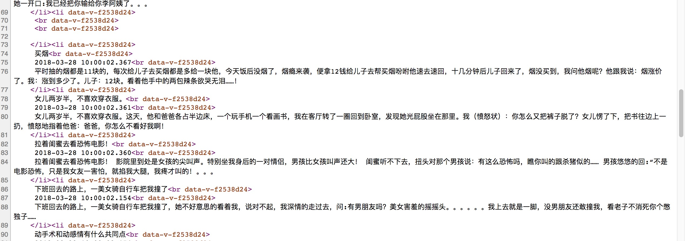

#vue-ssr从入门到放弃
# 入门
## ssr是什么

服务器端将Vue组件直接渲染未html字符串,发送至浏览器,最后在浏览器中混合为可交互的应用程序

服务器渲染的 Vue.js 应用程序也可以被认为是"同构"或"通用"，因为应用程序的大部分代码都可以在服务器和客户端上运行。

## 为什么要用

* 更好的 SEO



* 更快的内容到达时间(time-to-content)


## 怎么做

* vue-server-renderer 

* Nuxt.js 

是一个参考了 React.js 栈下的 Next.js 的一个更高封装接口的 SSR 框架。它封装了一层和 vue-router、vuex 及 webpack 设置这一层需求，可以快速开发 SSR.

* Prerendering

如果你调研服务器端渲染(SSR)只是用来改善少数营销页面（例如 /, /about, /contact 等）的 SEO，那么你可能需要预渲染。无需使用 web 服务器
实时动态编译 HTML，而是使用预渲染方式，在构建时(build time)简单地生成针对特定路由的静态 HTML 文件。优点是设置预渲染更简单，并可以将你
的前端作为一个完全静态的站点。
如果你使用 webpack，你可以使用 prerender-spa-plugin 轻松地添加预渲染。
 
## 缺点

* 开发条件所限。浏览器特定的代码，只能在某些生命周期钩子函数(lifecycle hook)中使用；一些外部扩展库(external library)可能需要特殊处理，
才能在服务器渲染应用程序中运行。

* 涉及构建设置和部署的更多要求。与可以部署在任何静态文件服务器上的完全静态单页面应用程序(SPA)不同，服务器渲染应用程序，需要处于
 Node.js server 运行环境。

* 更多的服务器端负载。在 Node.js 中渲染完整的应用程序，显然会比仅仅提供静态文件的 server 更加大量占用
 CPU 资源(CPU-intensive - CPU 密集)，因此如果你预料在高流量环境(high traffic)下使用，请准备相应的`服务器负载`，并明智地采用`缓存策略`。

## 注意事项

* 如果你打算为你的vue项目在node使用 SSR，那么在通用代码中，我们有必要并且需要遵守下面的这些约定：
   
* 通用代码: 在客户端与服务器端都会运行的部分为通用代码。
   
* 注意服务端只调用beforeCreat与created两个钩子，所以不可以做类似于在created初始化一个定时器，然后在mounted或者destroyed销毁这个定时
器，不然服务器会慢慢的被这些定时器给榨干了因单线程的机制，在服务器端渲染时，过程中有类似于单例的操作，那么所有的请求都会共享这个单例的操作，所以应该使用工厂函数来确保每个请求之间的独立性。

* 如有在beforeCreat与created钩子中使用第三方的API，需要确保该类API在node端运行时不会出现错误，比如在created钩子中初始化一个数据请求
的操作，这是正常并且及其合理的做法。但如果只单纯的使用XHR去操作，那在node端渲染时就出现问题了，所以应该采取axios这种浏览器端与服务器端
 都支持的第三方库。

* 最重要一点: 切勿在通用代码中使用document这种只在浏览器端可以运行的API，反过来也不可以使用只在node端可以运行的API。

# 疑惑
如何与中间层结合

# 结构预览


# 应用

## 坑

1. UnhandledPromiseRejectionWarning: Unhandled promise rejection (rejection id: 30): Error: connect ECONNREFUSED 127.0.0.1:80

控制台抛 uncaught ，这是多么贴心的功能。以前都是默默吃掉这个异常的，在一个项目里 debug 简直醉人。

https://www.zhihu.com/question/40876687/answer/88627772


2.http-proxy-middleware connect ECONNREFUSED 127.0.0.1:80

解决方法
１. 将node服务器端口改成　127.0.0.1:80 
2. 将接口服务器端口改成　127.0.0.1:80 
3. 将asyncData方法使用的请求url加上域名+端口，如下所示

``` 
export default {
  asyncData ({ params }) {
    return axios.get(`https://127.0.0.1:3000/api/${params.id}`)
    .then((res) => {
      return { title: res.data.title }
    })
  }
}
```
参考: [Nuxt ServerError connect ECONNREFUSED 127.0.0.1:80 错误解决](https://blog.csdn.net/qq_27068845/article/details/79382850)


3.axios 将post请求数据转为formdata

```js
axios({
            url: '/api/index/getIndexlbt',
            method: 'post',
            data: {
              relevanceId:this.$route.params.id,
              pictureType:4
            },
            transformRequest: [function (data) {
              let ret = ''
              for (let it in data) {
                ret += encodeURIComponent(it) + '=' + encodeURIComponent(data[it]) + '&'
              }
              return ret
            }],
            headers: {
              'Content-Type': 'application/x-www-form-urlencoded'
            }
          })
```
4.Computed property "currentPage" was assigned to but it has no setter
  ```js
  
   // currentPage () {
              //     return store.state.currentPage
              // }
  
              currentPage: {
                  get: function () {
                      return store.state.currentPage
                  },
                  set: function () {
                  }
              }
  ```
  https://segmentfault.com/q/1010000010358438/a-1020000010358925
  https://github.com/ElemeFE/mint-ui/issues/1000

5.vuex 的dispatch和commit提交mutation的区别
```
很简单，一个异步操作与同步操作的区别。

当你的操作行为中含有异步操作，比如向后台发送请求获取数据，就需要使用action的dispatch去完成了。
其他使用commit即可。
```
 [vue中更改state的值](https://segmentfault.com/q/1010000009619507/a-1020000009620104)
 
## 参考资料 

### 官方资料

[vue-ssr](https://ssr.vuejs.org/zh/)


#### ssr适合多页 还是 单页

https://github.com/vuejs/vue-hackernews-2.0/issues/187#issuecomment-303688734\

https://github.com/hilongjw/vue-ssr-hmr-template/issues/4

### 理解ssr

[简单的 Vue SSR Demo](https://juejin.im/entry/5a56c944518825734d1485bc)

[Vue项目SSR改造实战](https://segmentfault.com/a/1190000009373793)

[从零开始搭建vue-ssr系列之二：Client端渲染以及webpack2+vue2踩坑之旅](https://segmentfault.com/a/1190000009372772)

[从零开始搭建vue-ssr系列之三：服务器渲染的奥秘](https://segmentfault.com/a/1190000009373793)

### 好文推荐

[Vue项目SSR改造实战](https://segmentfault.com/a/1190000012440041)  可参考性比较强

[史上最详细易懂的vue服务端渲染（ssr）教程](https://github.com/zyl1314/vue-ssr)  可以简单理解,对于后期搭建好想没啥大用

[让vue-cli初始化后的项目集成支持SSR](http://blog.myweb.kim/vue/%E8%AE%A9vue-cli%E5%88%9D%E5%A7%8B%E5%8C%96%E5%90%8E%E7%9A%84%E9%A1%B9%E7%9B%AE%E9%9B%86%E6%88%90%E6%94%AF%E6%8C%81SSR/?utm-source=segmentfault) 

[vue-hackernews-2.0 源码解读](https://wangfuda.github.io/2017/05/14/vue-hackernews-2.0-code-explain/) 对项目整体结构说明,可以结合官方demo查看更佳

[Vue 全站服务器渲染 SSR 实践](http://gitbook.cn/books/591170568b2c1f0f85f3b8fb/index.html)

[详解 Vue & Vuex 实践](https://zhuanlan.zhihu.com/p/25042521)  掘金的项目实战

### vuex

官方文档：

[vuex action介绍](https://vuex.vuejs.org/zh-cn/actions.html)

[vuex2-demo](https://github.com/sailengsi/sls-vuex2-demo) demo不错


#### [vuex-demo](https://github.com/sailengsi/sls-vuex2-demo


### 可参考的demo

[官方demo](https://github.com/vuejs/vue-hackernews-2.0)  官方demo,大而全,存在接口墙的问题


[vnews](https://github.com/tiodot/vnews) 解决官方demo无法访问的问题, 功能类似vue-hackernews-2.0, 只不过内容源换成掘金网站，因而无法使用service worker的push功能。

[Beauty](https://github.com/beauty-enjoy/beauty)  听说挺好,但是没有尝试


#### 其他

[mmf-blog vuejs 2.0 服务端渲染 v2版](https://github.com/lincenying/mmf-blog-vue2-ssr)

[vue-cnode-mobile](https://github.com/soulcm/vue-cnode-mobile/)