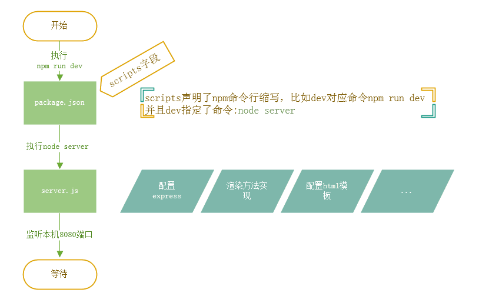

# vuecli2ssr

> vue-cli改为ssr配置

## Build Setup

``` bash
# install dependencies
npm install

# build for production with minification
npm run build


# serve no reload at localhost:8003
# 不带优化项的 实现功能
npm run dev

# serve with hot reload at localhost:8003
#根据官方demo实现的
npm run devHot


# build for production and view the bundle analyzer report
npm run build --report

# 开启服务
npm start

#访问(分页功能)
http://localhost:8003/pageList/1
http://localhost:8003/pageList/2 
```


## 目录结构

```js
│  package.json					# 项目配置文件
│  server.js					  # 最简单的服务端渲染
│  serverHot.js					# 热加载的服务端渲染
│  
├─public                                    	# 静态资源  
└─src
    │  app.js					# 整合 router,filters,vuex 的入口文件
    │  App.vue					# 根 vue 组件
    │  entry-client.js				# client 的入口文件
    │  entry-server.js				# server 的入口文件
    │  index.template.html			# html 模板
    │  
    ├─api
    │      create-api-client.js			# Client数据源配置
    │      create-api-server.js			# server数据源配置
    │      index.js				# 数据请求API
    │      
    ├─components
    │      Comment.vue				# 评论组件
    │      Item.vue				# 
    │      ProgressBar.vue			# 进度条组件
    │      Spinner.vue				# 加载提示组件
    │     
    ├─router
    │      index.js				# router配置
    │      
    ├─store					# Vue store模块
    │      actions.js				# 根级别的 action
    │      getters.js				# 属性接口
    │      index.js				# 我们组装模块并导出 store 的地方
    │      mutations.js				# 根级别的 mutation
    │      
    ├─util
    │      filters.js				# 过滤器
    │      title.js				# 工具类
    │      
    └─views
            CreateListView.js			# 动态生成列表界面的工厂方法
            ItemList.vue			# List界面组件
            ItemView.vue			# 单List项组件
            UserView.vue			# 用户界面组件

```
## 开发环境的服务端渲染流程



# 修改过程

>功能:根据url传参分页的demo

使用 vue-cli再次初始化一个项目:

1).创建vue-cli项目
`vue init webpack vue-ssr-demo`

```
cd vue-ssr-demo
npm install
npm run dev
```
2).满足基本功能

1.新增/src/view目录,对应的vue组件

2.安装axios, 新增用于测试的 /api/fetchItem
``npm i axios  -D``
3.安装 vuex ,新增 /store/index 并在 App.js中引入 store
`npm i axios vuex -D`

3)修改为ssr
1. 在src目录下创建两个js:
```
  src
  ├── entry-client.js # 仅运行于浏览器
  └── entry-server.js # 仅运行于服务器
  ```
3.修改 /src/router/index.js 配置

 修改引入组件改为异步组件
 router改为history模式
```js
import Vue from 'vue'
import Router from 'vue-router'

let indexList= () => import('@/view/index_list') // 改为异步组件
let pageList= () => import('@/view/page_list') // 改为异步组件

Vue.use(Router)

export function createRouter () {
  return new Router({
    mode: 'history', // 注意这里也是为history模式
    routes: [
      {
        path: '/',
        name: 'HelloWorld',
        component: indexList
      },
      {
        path: '/pageList/:id',
        name: 'pageList',
        component: pageList,
      },
    ]
  })
}

```
4. 改造app.js
app.js初始化的只适合在浏览器的运行，所以要改造两端都可以使用的文件，同样为了避免产生单例的影响，这里将导出一个createApp的工厂函数

```js
// app.js
import Vue from 'vue'
import App from './App.vue'
import { createRouter } from './router/index.ssr'
import { createStore } from './store/index.ssr'
import { sync } from 'vuex-router-sync'
export function createApp () {
  // 创建 router 实例
  const router = createRouter()
  const store = createStore()
  // 同步路由状态(route state)到 store
  sync(store, router)
  const app = new Vue({
    // 注入 router 到根 Vue 实例
    router,
    store,
    render: h => h(App)
  })
  // 返回 app 和 router
  return { app, router, store }
}
```

5.entry-client.js
```js
// entry-client.js
import { createApp } from './app'
import Vue from 'vue'

Vue.mixin({
  beforeRouteUpdate (to, from, next) {
    const { asyncData } = this.$options
    if (asyncData) {
      // 将获取数据操作分配给 promise
      // 以便在组件中，我们可以在数据准备就绪后
      // 通过运行 `this.dataPromise.then(...)` 来执行其他任务
      asyncData({
        store: this.$store,
        route: to
      }).then(next).catch(next)
    } else {
      next()
    }
  }
})

const { app, router, store } = createApp()
if (window.__INITIAL_STATE__) {
  store.replaceState(window.__INITIAL_STATE__)
}
router.onReady(() => {
  // 添加路由钩子函数，用于处理 asyncData.
  // 在初始路由 resolve 后执行，
  // 以便我们不会二次预取(double-fetch)已有的数据。
  // 使用 `router.beforeResolve()`，以便确保所有异步组件都 resolve。
  router.beforeResolve((to, from, next) => {
    const matched = router.getMatchedComponents(to)
    const prevMatched = router.getMatchedComponents(from)
    // 我们只关心之前没有渲染的组件
    // 所以我们对比它们，找出两个匹配列表的差异组件
    let diffed = false
    const activated = matched.filter((c, i) => {
      return diffed || (diffed = (prevMatched[i] !== c))
    })
    if (!activated.length) {
      return next()
    }
    // 这里如果有加载指示器(loading indicator)，就触发
    Promise.all(activated.map(c => {
      if (c.asyncData) {
        return c.asyncData({ store, route: to })
      }
    })).then(() => {
      // 停止加载指示器(loading indicator)
      next()
    }).catch(next)
  })
  app.$mount('#app')
})

```

6.entry-server.js
```js
// entry-server.js
import { createApp } from './app'
export default context => {
  // 因为有可能会是异步路由钩子函数或组件，所以我们将返回一个 Promise，
  // 以便服务器能够等待所有的内容在渲染前，
  // 就已经准备就绪。
  return new Promise((resolve, reject) => {
    const { app, router, store } = createApp()
    router.push(context.url)
    // 等到 router 将可能的异步组件和钩子函数解析完
    router.onReady(() => {
      const matchedComponents = router.getMatchedComponents()
      // 匹配不到的路由，执行 reject 函数，并返回 404
      if (!matchedComponents.length) {
        return reject({ code: 404 })
      }
      // 对所有匹配的路由组件调用 `asyncData()`
      Promise.all(matchedComponents.map(Component => {
        if (Component.asyncData) {
          return Component.asyncData({
            store,
            route: router.currentRoute
          })
        }
      })).then(() => {
        // 在所有预取钩子(preFetch hook) resolve 后，
        // 我们的 store 现在已经填充入渲染应用程序所需的状态。
        // 当我们将状态附加到上下文，
        // 并且 `template` 选项用于 renderer 时，
        // 状态将自动序列化为 `window.__INITIAL_STATE__`，并注入 HTML。
        context.state = store.state
        resolve(app)
      }).catch(reject)
    }, reject)
  })
}

```

7.server端

```js
const express = require('express')
const app = new express()
const fs = require('fs')
const path = require('path')
const { createBundleRenderer } = require('vue-server-renderer');

const resolve = file => path.resolve(__dirname, file)

// 生成服务端渲染函数
const renderer = createBundleRenderer(require('./dist/vue-ssr-server-bundle.json'), {
  // 推荐
  runInNewContext: false,
  // 模板html文件
  template: fs.readFileSync(resolve('./index.html'), 'utf-8'),
  // client manifest
  clientManifest: require('./dist/vue-ssr-client-manifest.json')
});

// 在服务器处理函数中……
app.get('*', async (req, res) => {
  console.log("被访问了~~")
  const context = {
    url: req.url ,
    title: '服务端渲染测试', // {{title}}
  }
  // 这里无需传入一个应用程序，因为在执行 bundle 时已经自动创建过。
  // 现在我们的服务器与应用程序已经解耦！
  renderer.renderToString(context, (err, html) => {
    res.end(html)
  })
})

const port = process.env.PORT || 8003;
app.listen(port, () => {
  console.log(`server started at localhost:${port}`)
})

```

8.将组件数据获取改为 预取
```js
  mounted: function () {
    //获取页数后 同步数据
    this.$store.dispatch('fetchItem',{
      id:this.$route.params.id
    })
  }
```
```js
 asyncData ({ store, route }) {
    // 触发 action 后，会返回 Promise
    return store.dispatch('fetchItem', route.params.id)
  },
   mounted: function () {
  
    }
```
